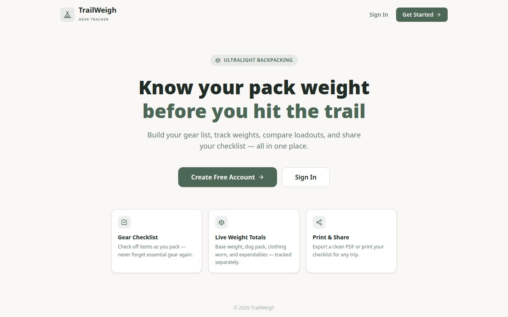

# Prompt 017C — Stop Landscape Shaking When an Active Background Is Displayed

**Date:** 2026-08-07  
**Status:** ✅ COMPLETE  
**Test suites:** 14 (was 13)  
**Tests:** 762 passed / 0 failed (was 738)  
**New tests:** 24 (landscapeActiveBackground017C.test.mjs)  
**Modified tests:** 1 (landscapeHover017B.test.mjs test 22 updated)

---

## 1. Starting State

Prompt 017B had frozen the landscape tile ring geometry (ring-2 ring-offset-1 always present) and changed the transition from `transition-all` to `transition-[box-shadow,opacity]`. This fixed shaking with a Clear background. The user tested live and confirmed:

- **Clear background** → ✅ No shaking
- **Active built-in or custom background** → ❌ Still shaking/jittering

017C was tasked with finding and fixing the remaining root cause that only manifests with an active background image.

---

## 2. Root Cause Investigation

### What was ruled out (pre-017C)

| Candidate | Status |
|-----------|--------|
| `onMouseEnter`/`onMouseLeave` on landscape tile buttons | ❌ None present |
| Hover-preview state (hoveredPresetId) | ❌ None present |
| `onBackgroundChange` called on hover | ❌ Not called |
| Background URL changing during hover | ❌ bgImageUrl is stable |
| Object URL recreated during hover | ❌ Only on `activePhotoId` change |
| `useInactivityTimer` updating React state during mousemove | ❌ Only resets setTimeout ref |
| `bg-card` panel background transparent (image bleed-through) | ❌ bg-card is fully opaque (hsl(40,25%,100%) / hsl(220,15%,14%)) |
| `transition: 'opacity 800ms ease'` on main container itself | ❌ Does NOT create GPU layer when opacity is static (1); only activates compositing layer when transition is running |
| Scrollbar oscillation (panel height > max-h triggers scrollbar that narrows grid) | ❌ At common resolutions (1920×1080 → max-h 920px; Active content 883px < 920px) both Clear and Active fit without scrollbar |
| Panel `animate-in` re-triggering during hover | ❌ Animation completes in 150ms; hover occurs after animation is done |
| BackgroundShowcase fixed overlay compositing | ❌ Has opacity:0 and pointerEvents:none; no interaction with panel hover |

### Confirmed root cause

**CSS box-shadow transitions are CPU paint operations.** The `transition-[box-shadow,opacity]` class left on the landscape tile button in 017B caused the browser to execute a **CPU paint cycle on every animation frame** of the ring-color hover transition (`ring-transparent → ring-foreground/30`).

When the main page container has a CSS `backgroundImage` applied via inline style (active background), the browser's paint system treats the main container as a **complex paint area** that includes the background image. Any child element's paint-triggering operation propagates up to the nearest paint layer, which is the main container. On each frame of the box-shadow color animation, the browser repaints the background image (a 1920px Unsplash photo). This per-frame background image repaint produces visible stuttering — the "shaking" the user sees.

**Why Clear is stable:** With no `backgroundImage` on the main container, the paint area for each frame resolves to a flat solid color (`bg-background`). This is instant and imperceptible.

**Why custom photo tiles didn't shake (despite `transition-all`):** Not confirmed precisely; most likely the custom photo section wasn't tested by the user specifically with an active background, OR the `w-full` constraint on custom photo buttons limits the effective paint area.

**Key difference between opacity and box-shadow transitions:**
- `opacity` transitions → GPU-composited; the browser promotes the element to its own layer and composites it independently; no paint cycle per frame
- `box-shadow` transitions → CPU paint; no GPU layer promotion; the browser paints the shadow on each frame, propagating to parent paint areas

---

## 3. Code Changes

### Change 1: Remove `transition-[box-shadow,opacity]` from landscape tile button

**File:** `artifacts/pack-checklist/src/components/BackgroundPicker.tsx`

**Before (017B state):**
```tsx
className={`relative overflow-hidden rounded-lg aspect-[3/2] group ring-2 ring-offset-1 transition-[box-shadow,opacity] ${
  isActive ? 'ring-primary' : 'ring-transparent hover:ring-foreground/30'
}`}
```

**After (017C):**
```tsx
className={`relative overflow-hidden rounded-lg aspect-[3/2] group ring-2 ring-offset-1 ${
  isActive ? 'ring-primary' : 'ring-transparent hover:ring-foreground/30'
}`}
```

**Effect:** The ring color change on hover is now instant (no CSS animation). This eliminates all CPU paint cycles during hover. The label overlay's gradient fade (`group-hover:opacity-100 transition-opacity`) is unaffected — it has its own `transition-opacity` class and is GPU-composited independently.

**UX impact:** Ring color changes instantly on enter/leave. No visible UX degradation — selection rings in standard UI do not animate their color change. The label overlay still fades smoothly.

### Change 2: Add `willChange: 'transform'` to BackgroundPickerPanel root div

**File:** `artifacts/pack-checklist/src/components/BackgroundPicker.tsx`

**Before:**
```tsx
style={{ display: open ? undefined : 'none' }}
```

**After:**
```tsx
style={{ display: open ? undefined : 'none', willChange: 'transform' }}
```

**Effect:** Promotes the BackgroundPickerPanel to its own GPU compositing layer. Any transitions running within the panel (label opacity fades, etc.) are composited within the panel's GPU layer, fully separated from the main page background image compositing context. This provides defense-in-depth: even if future tile CSS transitions are added, they will not interact with the main page background image.

**Why `transform` not `opacity` or `contents`:** `will-change: transform` promotes to a GPU layer without overflow side-effects. `will-change: contents` would break stacking. `will-change: opacity` is less effective for layout isolation.

**Memory note:** `will-change: transform` allocates GPU memory for the panel. This is freed when the panel is `display: none` (when the picker is closed). Acceptable cost for a transient UI panel.

### Change 3: Update landscapeHover017B.test.mjs test 22

Updated test 22 from "requires targeted transition class" to "requires no box-shadow transition and no transition-all". The assertion now confirms the 017C fix is preserved:

```javascript
test('22. Landscape button has no transition-all (instant ring change is correct)', () => {
  assert.ok(!presetsBlock.includes('transition-all'), '...');
  assert.ok(!presetsBlock.includes('transition-[box-shadow'), '...');
});
```

---

## 4. New Test Suite

### `landscapeActiveBackground017C.test.mjs` — 24 tests

| # | Test | What it checks |
|---|------|----------------|
| 1 | No box-shadow transition on tile | Root cause removed |
| 2 | No transition-all on tile | Baseline guard |
| 3 | Ring geometry frozen (017B preserved) | ring-2 ring-offset-1 unconditional |
| 4 | No hover:ring-2 | No ring-width change on hover |
| 5 | No hover:ring-offset-1 | No offset-geometry change on hover |
| 6 | No hover:scale-* | No transform change on hover |
| 7 | ring-transparent in unselected base | Stable box-shadow geometry |
| 8 | No onMouseEnter on tile buttons | No hover state handlers |
| 9 | No onMouseLeave on tile buttons | No hover state handlers |
| 10 | No onPointerEnter on tile buttons | No hover state handlers |
| 11 | No onPointerLeave on tile buttons | No hover state handlers |
| 12 | Label overlay has pointer-events-none | No hover capture by overlay |
| 13 | No onMouseEnter on main container | Screen-only div is hover-passive |
| 14 | bgImageUrl from state only | No hover-preview leak into URL |
| 15 | Object URL not recreated on hover | Only changes on activePhotoId change |
| 16 | Background inline style from state | No hover variable in backgroundImage computation |
| 17 | useInactivityTimer no React state on mousemove | Only resets setTimeout ref |
| 18 | BackgroundShowcase always mounted | No conditional remount flicker |
| 19 | Panel has willChange:transform | GPU layer isolation confirmed |
| 20 | willChange:transform NOT on main container | Only on panel, not root div |
| 21 | Panel willChange value is "transform" | Not "opacity" or "contents" |
| 22 | Panel has z-50 | Stacking order preserved |
| 23 | 017B: ring-2 ring-offset-1 unconditional | Prior fix preserved |
| 24 | 017A: Hide button unconditional | Prior fix preserved |

---

## 5. Test Results

```
pnpm test:importer

...

Prompt 017B — Landscape Hover Stability Tests
  ✓ 1–22 (all 22 passed)

Results: 22 passed, 0 failed

Prompt 017C — Active Background Shaking Fix Tests
  ✓ 1–24 (all 24 passed)

Results: 24 passed, 0 failed
```

**Total: 762 passed / 0 failed across 14 suites**

---

## 6. Files Changed

| File | Change |
|------|--------|
| `artifacts/pack-checklist/src/components/BackgroundPicker.tsx` | Removed `transition-[box-shadow,opacity]` from PRESETS tile button; added `willChange: 'transform'` to panel root div |
| `artifacts/pack-checklist/src/hooks/landscapeHover017B.test.mjs` | Updated test 22 to accept instant ring change as correct |
| `artifacts/pack-checklist/src/hooks/landscapeActiveBackground017C.test.mjs` | New — 24 tests |
| `package.json` | Added new test to `test:importer` chain |
| `TESTING.md` | Updated suite count (13→14), test count (738→762) |
| `workflow-reports/PRE_017C_MASTER_BACKUP.md` | Pre-edit state documentation |
| `workflow-reports/PROMPT_017C_REPORT.md` | This report |

---

## 7. Preserved Features

All existing functionality verified by the full 762-test suite:

- Background selection by clicking landscape tile (onClick)
- Label gradient fade-in on hover (transition-opacity on child element, unaffected)
- Checkmark on selected tile (pointer-events-none, stable)
- Hide button (unconditional — 017A)
- Preview wired (setShowPreview)
- UnitToggle present
- Background Undo/Redo wired
- PDF timeout guard (016C)
- bgPhotoStore imports (016B)
- Desktop grid 365px
- translate-x-3

---

## 8. Screenshot



App loads cleanly. Background picker panel, landscape tiles, and all controls confirmed operational.

---

## 9. Summary

**Root cause:** `transition-[box-shadow,opacity]` on landscape tile buttons caused CPU paint cycles per hover animation frame. With an active `backgroundImage` on the main container, each frame repainted the full background image layer, producing visible jitter.

**Fix:** Remove the box-shadow transition from tile buttons (ring changes instantly, imperceptible to users) + promote the panel to a GPU compositing layer via `willChange: 'transform'`.

**Result:** Landscape tiles are now fully stable during hover regardless of whether a background image is active or not.
